<!-- TOC -->

- [1. examples show cases](#1-examples-show-cases)
    - [1.1. 7GUIs](#11-7guis)
    - [1.2. browsers](#12-browsers)
    - [1.3. chart](#13-chart)
    - [1.4. choice](#14-choice)
    - [1.5. custom-dial](#15-custom-dial)
    - [1.6. dnd](#16-dnd)
    - [1.7. flex](#17-flex)
    - [1.8. flutter-like](#18-flutter-like)
    - [1.9. grid](#19-grid)
    - [1.10. group](#110-group)
    - [1.11. helpview](#111-helpview)
    - [1.12. icons](#112-icons)
    - [1.13. image](#113-image)
    - [1.14. input_choice](#114-input_choice)
    - [1.15. maviewver](#115-maviewver)
    - [1.16. native_file_chooser](#116-native_file_chooser)
    - [1.17. opengl](#117-opengl)
    - [1.18. paint](#118-paint)
    - [1.19. rgb_image](#119-rgb_image)
    - [1.20. styled_text](#120-styled_text)
    - [1.21. svg](#121-svg)
    - [1.22. table](#122-table)
    - [1.23. tabs](#123-tabs)
    - [1.24. texteditor](#124-texteditor)
    - [1.25. timeout](#125-timeout)
    - [1.26. toggle](#126-toggle)
    - [1.27. ui-config](#127-ui-config)
    - [1.28. ui-config-grid](#128-ui-config-grid)
    - [1.29. widget_table](#129-widget_table)
    - [1.30. wizard](#130-wizard)

<!-- /TOC -->

# 1. examples show cases

## 1.1. 7GUIs
titile     | pre raw|
|--------|-----|
|7GUIs_cell||
|7GUIs_circle||
|7GUIs_counter||
|7GUIs_crud||
|7GUIs_flightbooker|  |
|7GUIs_temperature||
|7GUIs_Timer||

## 1.2. browsers
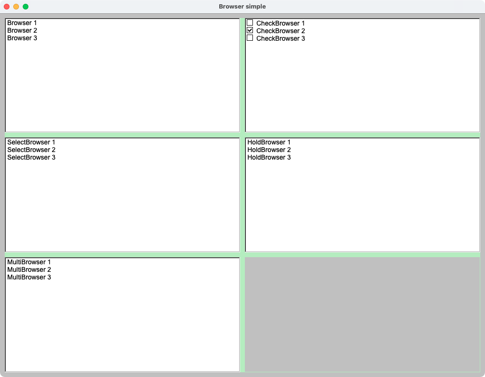

## 1.3. chart
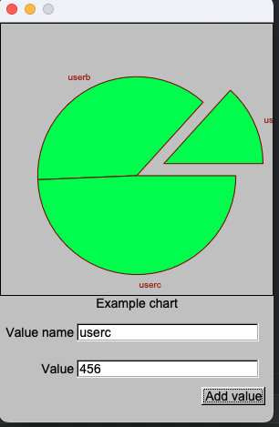

## 1.4. choice
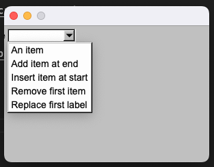

## 1.5. custom-dial

## 1.6. dnd

## 1.7. flex
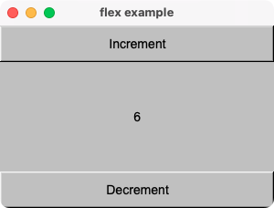

## 1.8. flutter-like
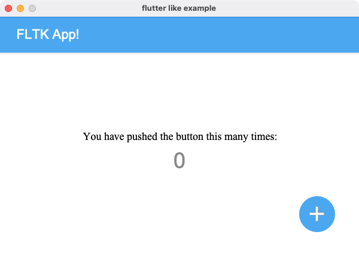

## 1.9. grid

## 1.10. group

## 1.11. helpview
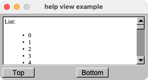

## 1.12. icons

## 1.13. image

## 1.14. input_choice

## 1.15. maviewver

## 1.16. native_file_chooser

## 1.17. opengl
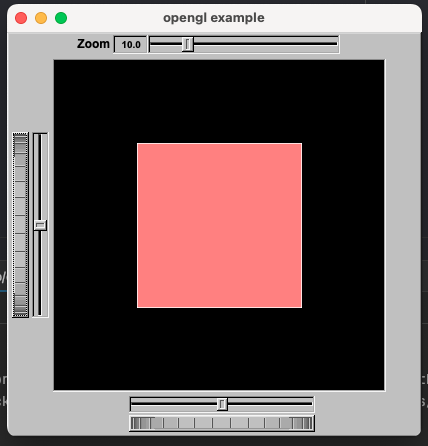

## 1.18. paint

## 1.19. rgb_image

## 1.20. styled_text
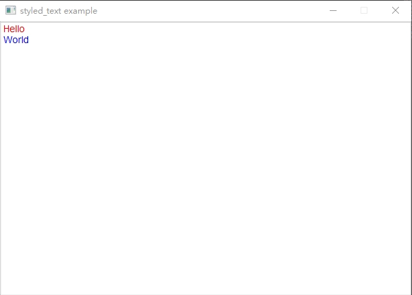

## 1.21. svg
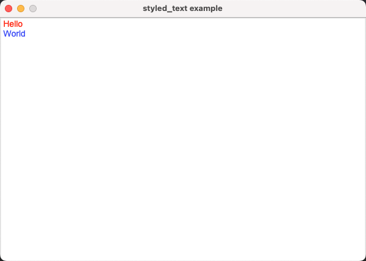

## 1.22. table

## 1.23. tabs

## 1.24. texteditor
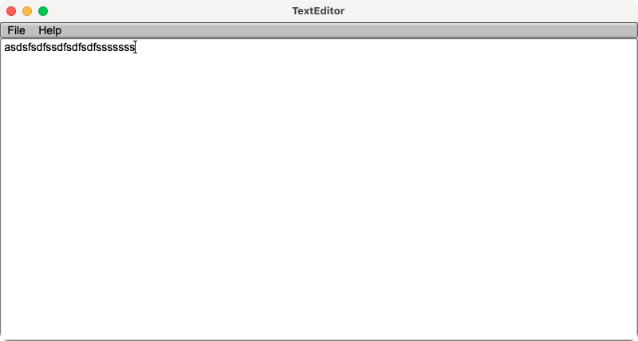

## 1.25. timeout
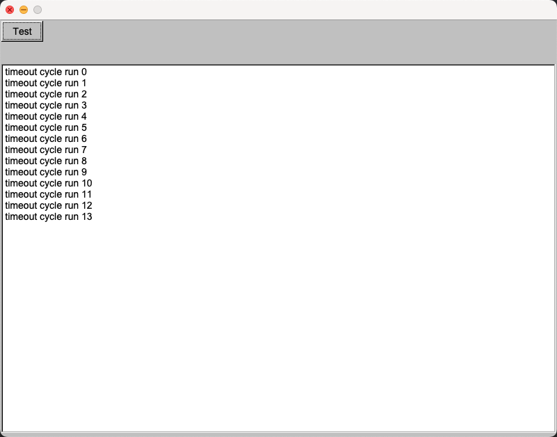

## 1.26. toggle
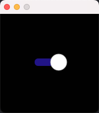

## 1.27. ui-config

## 1.28. ui-config-grid
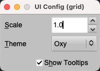

## 1.29. widget_table

## 1.30. wizard
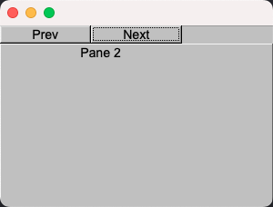

